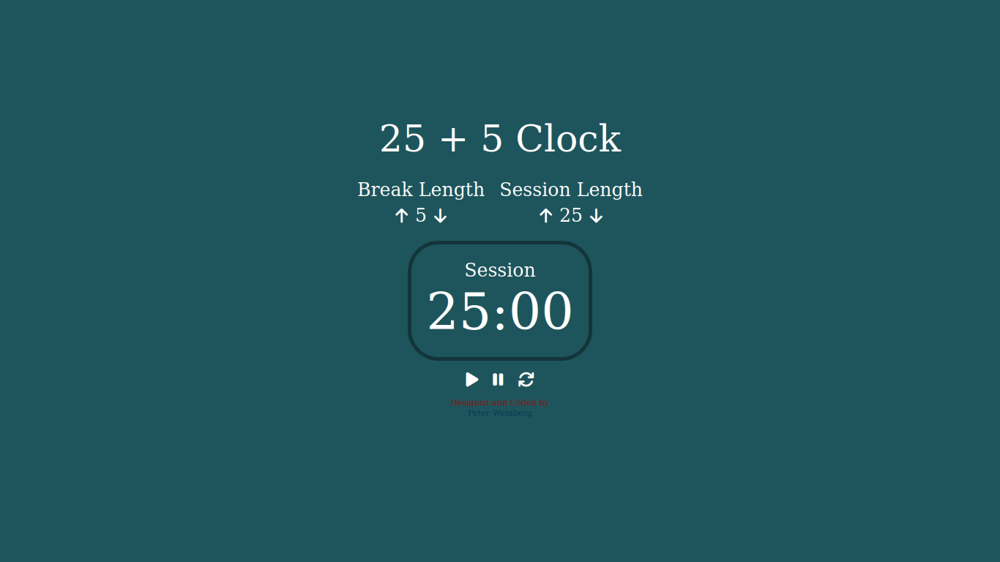
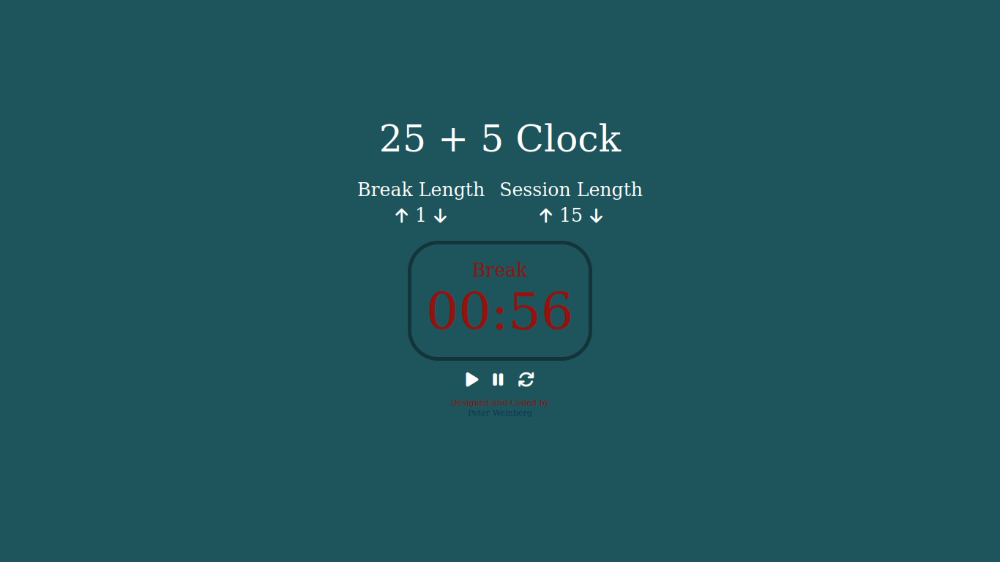

# Relógio 25 + 5

Esta aplicação apresenta um relógio baseado na técnica Pomodoro, onde são definidos intervalos de tempo para a realização de uma tarefa e para descanso. Inicialmente são definidos tempos de 25 e 5 minutos, respectivamente, mas estes valores podem ser personalizados.

Este projeto foi desenvolvido para obter a certificação em Bibliotecas de Desenvolvimento Front-End na plataforma freeCodeCamp.

##  :gear: Tecnologias

- HTML
- CSS
- JavaScript
- React
- Redux

##  :art: Layout

